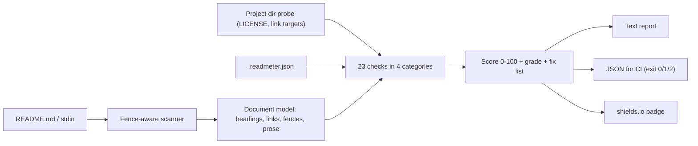

# readmeter

[English](README.md) | [中文](README.zh.md) | [日本語](README.ja.md)

[](LICENSE)   [](CONTRIBUTING.md)

**readmeter は、具体的で文書化されたチェックリストに沿って README を 0-100 点で採点し、優先度順の修正案を出力します——完全オフライン、ランタイム依存ゼロ、CI 対応の終了コード付き。**


```bash
# not yet on npm — install from a checkout of this repository
npm install && npm run build && npm pack
npm install -g ./readmeter-0.1.0.tgz
```

ジャンプ：[なぜ readmeter？](#なぜ-readmeter) · [特長](#特長) · [クイックスタート](#クイックスタート) · [チェックリスト](#チェックリスト) · [設定と終了コード](#設定と終了コード) · [アーキテクチャ](#アーキテクチャ)

## なぜ readmeter？

README はコードのランディングページです。訪問者の多くは 1 分以内に判断を下し、離脱の理由は退屈なほど予測可能——インストールコマンドがない、使用例がない、ライセンスがない、テンプレートに残った `TODO`。README を採点するツールは以前からありましたが、有名どころはいずれもホスト型のウェブアプリで、すでに停止しており、説明もなく CI にも組み込めない数字を返すだけでした。readmeter はその逆です：**文書化された 23 のチェック**（それぞれに安定コード・重み・成文化された部分点の段階）を備えたローカル CLI で、すべての指摘に行番号付きの根拠が添えられ、修正リストは回復できる点数順に並び、`--min-score` ゲートで全体が 2 行の CI ステップになります。読むのはあなたのファイルだけで、他には何も触れず、同じバイト列には常に同じスコアを返します。

|  | readmeter | readme-score（ウェブ版） | standard-readme lint | awesome-readme リスト |
|---|---|---|---|---|
| オフライン動作 / 自己完結 | はい | いいえ（ホスト型、既に停止） | はい | 対象外（読み物リスト） |
| 文書化されたルールでの採点 | 0-100、23 ルールを docs/ に明記 | 不透明な数値 | 合否のみ | 採点なし |
| 優先度順・行番号付きの修正案 | はい | いいえ | エラーの羅列 | いいえ |
| CI ゲート（終了コード + JSON） | `--min-score`、終了コード 0/1/2 | いいえ | 部分的 | いいえ |
| リポジトリ文脈の検査（LICENSE・リンク） | はい | いいえ | いいえ | いいえ |
| ランタイム依存 | 0 | ホスト型サービス | Node ツールチェーン | 対象外 |

<sub>各機能の記載は各プロジェクトの公開リポジトリまたはアーカイブページで確認、2026-07。</sub>

## 特長

- **雰囲気ではなく本物の採点基準** — 基礎（43 点）・構造（15 点）・内容（26 点）・衛生（16 点）にわたる 23 のチェック。重みと部分点の段階はすべて [docs/checks.md](docs/checks.md) に明記。
- **優先度順の修正リスト** — 失敗項目は「+10 E103：コピペ可能なコマンド付きの Install 節を追加」のように、回復できる点数順に並んだ修正リストとして返されます。
- **行番号付きの根拠** — `"TODO" at line 19`、`broken link "docs/setup.md" at line 9`。参照先のない指摘は一つもありません。
- **設計段階から CI 対応** — `--min-score 80` は基準未満で終了コード 1、`--format json` はキー順が安定、`.readmeter.json` でポリシーをリポジトリに固定。
- **正直なスキップ** — 適用不能なチェック（stdin 入力でのリンク解決、コードが皆無な場合のフェンス言語タグ）は黙って合否を出さず、分母から除外されます。
- **ランタイム依存ゼロ、完全オフライン** — 必要なのは Node.js だけ。ツールはソケットを一切開かず、devDependency は `typescript` のみです。

## クイックスタート

インストール：

```bash
# not yet on npm — install from a checkout of this repository
npm install && npm run build && npm pack
npm install -g ./readmeter-0.1.0.tgz
```

README を採点します（リポジトリ直下で、同梱の悪い例を対象に）：

```bash
readmeter score examples/bad/README.md
```

出力（実際の実行記録。中間部は省略）：

```text
readmeter v0.1.0 — examples/bad/README.md

score 23/100  grade F  (3 passed, 5 partial, 14 failed, 1 skipped)

essentials                            11/43
  x E101  project-title           0/8     no H1 heading found
  + E102  one-line-description    6/6     description found (line 3)
  x E103  install-steps           0/10    no install section and no install command anywhere
  ~ E104  usage-example           5/10    code example found (line 13) but under no Usage heading
  x E105  license-stated          0/9     no license section, link or mention

top fixes (+75.1 points available)
   1. +10   E103 install-steps — Add an "## Install" section with one copy-pasteable command per supported method.
   2. +9    E105 license-stated — Pick a license, commit it as LICENSE, and add a "## License" section linking it.
   3. +8    E101 project-title — Start the README with `# <project-name>` on the first line.
```

Pull Request にゲートを設け、共有できるバッジを生成します（実際の実行記録）：

```bash
readmeter score README.md --min-score 80   # exit 1 when below the bar
readmeter badge README.md
```

```text

```

同梱の `examples/good/README.md` は 100 点/A 評価で、全チェックが満たされた姿を示します。他のシナリオは [examples/](examples/README.md) にあります。

## チェックリスト

コードは安定 API——意味が変わることはありません。`readmeter checks` は最新の一覧表を、`readmeter explain <code>` は個別ルールの根拠を表示し、[docs/checks.md](docs/checks.md) にすべての部分点の段階が記載されています。

| カテゴリ | コード | 配点 | 対象 |
|---|---|---|---|
| 基礎 | E101–E105 | 43 | タイトル、一行説明、インストール手順、使用例、ライセンス |
| 構造 | S201–S205 | 15 | 見出し階層、長文の目次、健全な分量、クイックスタートの位置、空セクション禁止 |
| 内容 | C301–C308 | 26 | フェンス言語タグ、バッジ、出力例、前提条件、貢献案内、ビジュアル、特長、ドキュメントリンク |
| 衛生 | H401–H405 | 16 | プレースホルダ、ローカルパス漏れ、切れた相対リンク、裸の URL、重複見出し |

## 設定と終了コード

作業ディレクトリの `.readmeter.json` は自動で読み込まれます（`--config` でパスを上書き可能。フラグはファイル値より優先）。未知のキー、型違い、未知のチェックコードはすべてハードエラー——タイプミスが採点ポリシーを静かに変えることはありません。

| キー | デフォルト | 効果 |
|---|---|---|
| `disable` | `[]` | 採点から除外するチェックコード（分母もその分縮小） |
| `minScore` | `null` | このスコア未満で失敗（終了コード 1）——CI ゲート |

終了コードは全サブコマンド共通：`0` 正常、`1` ゲート未達、`2` 用法/設定/IO エラー——スクリプトは「README が悪い」と「コマンドの打ち間違い」を区別できます。採点の詳細、評価バンド、スキップの哲学は [docs/scoring.md](docs/scoring.md) を参照。

## アーキテクチャ



## ロードマップ

- [x] 23 チェックの採点器：成文化された段階、正直なスキップ、順位付き修正、JSON 出力、`--min-score` ゲート、設定ファイル、stdin モード、オフラインバッジ（v0.1.0）
- [ ] `--fix` スキャフォールド：欠けている基礎節のひな形を挿入
- [ ] 重みプロファイルのカスタマイズ（ライブラリ / CLI / データセット README 別）
- [ ] スキャナの HTML 見出しと GitHub アラート記法への対応
- [ ] Monorepo モード：ディレクトリ以下の全 README を一括採点

全リストは [open issues](https://github.com/JaydenCJ/readmeter/issues) を参照してください。

## コントリビュート

貢献を歓迎します。`npm install && npm run build` でビルドし、`npm test`（85 テスト）と `bash scripts/smoke.sh`（`SMOKE OK` の出力が必須）を実行してください——このリポジトリは CI を持たず、上記の主張はすべてローカル実行で検証されています。[CONTRIBUTING.md](CONTRIBUTING.md) を読み、[good first issue](https://github.com/JaydenCJ/readmeter/issues?q=is%3Aissue+is%3Aopen+label%3A%22good+first+issue%22) を選ぶか、[discussion](https://github.com/JaydenCJ/readmeter/discussions) を始めてください。

## ライセンス

[MIT](LICENSE)
