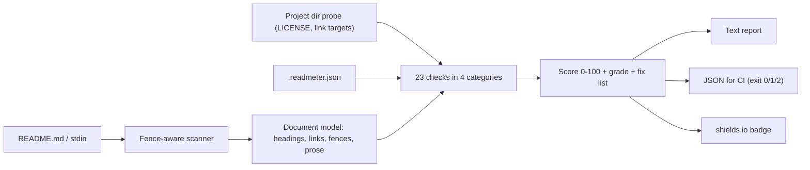

# readmeter

[English](README.md) | [中文](README.zh.md) | [日本語](README.ja.md)

[](LICENSE)   [](CONTRIBUTING.md)

**readmeter grades a README 0-100 against a concrete, documented checklist and prints prioritized fixes — offline, zero runtime dependencies, CI-ready exit codes.**


```bash
# not yet on npm — install from a checkout of this repository
npm install && npm run build && npm pack
npm install -g ./readmeter-0.1.0.tgz
```

Jump to: [Why readmeter?](#why-readmeter) · [Features](#features) · [Quickstart](#quickstart) · [The checklist](#the-checklist) · [Configuration](#configuration-and-exit-codes) · [Architecture](#architecture)

## Why readmeter?

Your README is the landing page for your code: most visitors decide in under a minute, and the things that lose them are boringly predictable — no install command, no usage example, no license, a `TODO` left over from the template. Tools that scored READMEs have existed before, but the well-known ones were hosted web apps that have since gone dark, and they returned a number with no explanation and no way to run in CI. readmeter is the opposite: a local CLI with **23 documented checks** (each with a stable code, a weight and written partial-credit tiers), line-numbered evidence for every finding, a fix list ordered by how many points each repair recovers, and a `--min-score` gate that makes the whole thing a two-line CI step. It reads your file, touches nothing else, and produces the same score for the same bytes, every time.

|  | readmeter | readme-score (web) | standard-readme lint | awesome-readme lists |
|---|---|---|---|---|
| Works offline / self-contained | yes | no (hosted, now defunct) | yes | n/a (a reading list) |
| Score with documented rules | 0-100, 23 rules in docs/ | opaque number | pass/fail only | no scoring |
| Prioritized, line-numbered fixes | yes | no | error dump | no |
| CI gate (exit codes + JSON) | `--min-score`, exit 0/1/2 | no | partial | no |
| Checks repo context (LICENSE, links) | yes | no | no | no |
| Runtime dependencies | 0 | hosted service | Node toolchain | n/a |

<sub>Capability claims checked against each project's public repository or archived pages, 2026-07.</sub>

## Features

- **A real rubric, not vibes** — 23 checks across essentials (43 pts), structure (15), content (26) and hygiene (16); every weight and partial-credit tier is written down in [docs/checks.md](docs/checks.md).
- **Prioritized fixes** — failures come back as a ranked repair list ("+10 E103: add an Install section with a copy-pasteable command"), sorted by points recovered.
- **Evidence with line numbers** — `"TODO" at line 19`, `broken link "docs/setup.md" at line 9`; nothing is asserted without a place to look.
- **CI-ready by design** — `--min-score 80` exits 1 below the bar, `--format json` is stable-keyed, and `.readmeter.json` pins the policy per repo.
- **Honest skips** — checks that cannot apply (link resolution on stdin, fence tags with no code) are removed from the denominator instead of silently passing or failing.
- **Zero runtime dependencies, fully offline** — Node.js is the only requirement; the tool never opens a socket, and `typescript` is the sole devDependency.

## Quickstart

Install:

```bash
# not yet on npm — install from a checkout of this repository
npm install && npm run build && npm pack
npm install -g ./readmeter-0.1.0.tgz
```

Score a README (the bundled bad example, from the repo root):

```bash
readmeter score examples/bad/README.md
```

Output (real captured run; middle sections elided):

```text
readmeter v0.1.0 — examples/bad/README.md

score 23/100  grade F  (3 passed, 5 partial, 14 failed, 1 skipped)

essentials                            11/43
  x E101  project-title           0/8     no H1 heading found
  + E102  one-line-description    6/6     description found (line 3)
  x E103  install-steps           0/10    no install section and no install command anywhere
  ~ E104  usage-example           5/10    code example found (line 13) but under no Usage heading
  x E105  license-stated          0/9     no license section, link or mention

top fixes (+75.1 points available)
   1. +10   E103 install-steps — Add an "## Install" section with one copy-pasteable command per supported method.
   2. +9    E105 license-stated — Pick a license, commit it as LICENSE, and add a "## License" section linking it.
   3. +8    E101 project-title — Start the README with `# <project-name>` on the first line.
```

Gate a pull request and generate a shareable badge (real captured run):

```bash
readmeter score README.md --min-score 80   # exit 1 when below the bar
readmeter badge README.md
```

```text

```

The bundled `examples/good/README.md` scores 100/A and shows what every check looks like when satisfied; more scenarios live in [examples/](examples/README.md).

## The checklist

Codes are stable API — they never change meaning. `readmeter checks` prints the live table, `readmeter explain <code>` prints one rule's rationale, and [docs/checks.md](docs/checks.md) documents every partial-credit tier.

| Category | Codes | Points | What it covers |
|---|---|---|---|
| Essentials | E101–E105 | 43 | title, one-line description, install steps, usage example, license |
| Structure | S201–S205 | 15 | heading hierarchy, TOC when long, healthy length, quickstart position, no empty sections |
| Content | C301–C308 | 26 | fence language tags, badges, captured output, prerequisites, contributing, visuals, features, docs links |
| Hygiene | H401–H405 | 16 | placeholders, leaked local paths, broken relative links, bare URLs, duplicate headings |

## Configuration and exit codes

`.readmeter.json` in the working directory is picked up automatically (`--config` overrides the path; flags beat file values). Unknown keys, wrong types and unknown check codes are hard errors — a typo cannot silently change the grading policy.

| Key | Default | Effect |
|---|---|---|
| `disable` | `[]` | Check codes excluded from scoring (denominator shrinks accordingly) |
| `minScore` | `null` | Fail (exit 1) below this score — the CI gate |

Exit codes are shared by all subcommands: `0` ok, `1` score below the gate, `2` usage/config/IO error — so scripts can tell a bad README from a bad invocation. Scoring details, grade bands and the skip philosophy are in [docs/scoring.md](docs/scoring.md).

## Architecture



## Roadmap

- [x] 23-check scorer with documented tiers, honest skips, ranked fixes, JSON output, `--min-score` gate, config file, stdin mode and offline badges (v0.1.0)
- [ ] `--fix` scaffolding: insert stub sections for missing essentials
- [ ] Custom weight profiles (library vs CLI vs dataset READMEs)
- [ ] HTML heading and GitHub-alert syntax support in the scanner
- [ ] Monorepo mode: score every README under a directory in one run

See the [open issues](https://github.com/JaydenCJ/readmeter/issues) for the full list.

## Contributing

Contributions are welcome. Build with `npm install && npm run build`, then run `npm test` (85 tests) and `bash scripts/smoke.sh` (must print `SMOKE OK`) — this repository ships no CI, every claim above is verified by local runs. See [CONTRIBUTING.md](CONTRIBUTING.md), grab a [good first issue](https://github.com/JaydenCJ/readmeter/issues?q=is%3Aissue+is%3Aopen+label%3A%22good+first+issue%22), or start a [discussion](https://github.com/JaydenCJ/readmeter/discussions).

## License

[MIT](LICENSE)
