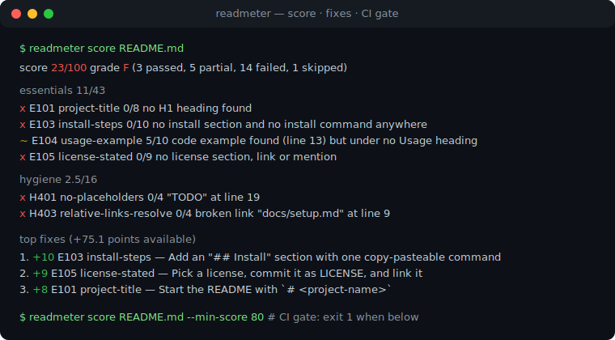
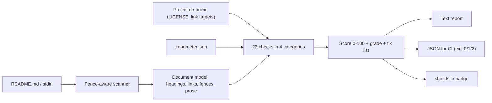

# readmeter

[English](README.md) | [中文](README.zh.md) | [日本語](README.ja.md)

[](LICENSE)   [](CONTRIBUTING.md)

**readmeter 按一份具体、有文档的检查清单给 README 打 0-100 分，并输出按优先级排序的修复建议——完全离线、零运行时依赖、退出码可直接进 CI。**



```bash
# not yet on npm — install from a checkout of this repository
npm install && npm run build && npm pack
npm install -g ./readmeter-0.1.0.tgz
```

快速跳转：[为什么选 readmeter？](#为什么选-readmeter) · [特性](#特性) · [快速上手](#快速上手) · [检查清单](#检查清单) · [配置与退出码](#配置与退出码) · [架构](#架构)

## 为什么选 readmeter？

README 就是代码的落地页：多数访客不到一分钟就会做决定，而流失的原因无聊得可以预测——没有安装命令、没有使用示例、没有许可证、模板里残留的 `TODO`。给 README 打分的工具以前也有，但知名的那些都是托管网页应用，如今早已下线，而且只返回一个既无解释、也无法跑进 CI 的数字。readmeter 恰好相反：一个本地 CLI，带 **23 条有文档的检查**（每条都有稳定代码、权重和成文的部分得分档位），每条发现都附带行号证据，修复清单按可挽回分数排序，`--min-score` 门槛让整套东西变成两行 CI 步骤。它只读你的文件，不碰其他任何东西，同样的字节永远得到同样的分数。

|  | readmeter | readme-score（网页版） | standard-readme lint | awesome-readme 清单 |
|---|---|---|---|---|
| 离线可用 / 自包含 | 是 | 否（托管，已停摆） | 是 | 不适用（只是阅读清单） |
| 有文档规则的评分 | 0-100，23 条规则在 docs/ | 不透明的数字 | 仅通过/不通过 | 无评分 |
| 按优先级、带行号的修复建议 | 是 | 否 | 错误堆砌 | 否 |
| CI 门槛（退出码 + JSON） | `--min-score`，退出码 0/1/2 | 否 | 部分 | 否 |
| 检查仓库上下文（LICENSE、链接） | 是 | 否 | 否 | 否 |
| 运行时依赖 | 0 | 托管服务 | Node 工具链 | 不适用 |

<sub>各项能力说明均对照各项目的公开仓库或存档页面核实，2026-07。</sub>

## 特性

- **真正的评分细则，不靠感觉** — 23 条检查横跨基础项（43 分）、结构（15 分）、内容（26 分）与卫生（16 分）；每个权重和部分得分档位都写在 [docs/checks.md](docs/checks.md)。
- **按优先级排序的修复** — 失败项以排序后的修复清单返回（"+10 E103：添加带可复制粘贴命令的 Install 小节"），按可挽回分数排列。
- **带行号的证据** — `"TODO" at line 19`、`broken link "docs/setup.md" at line 9`；每条论断都有出处可查。
- **为 CI 而生** — `--min-score 80` 低于门槛即退出 1，`--format json` 键序稳定，`.readmeter.json` 把策略固定在仓库里。
- **诚实的跳过** — 无法适用的检查（stdin 输入时的链接解析、没有代码时的围栏标注）会从分母中移除，而不是悄悄判过或判败。
- **零运行时依赖，完全离线** — 只需要 Node.js；工具从不打开套接字，`typescript` 是唯一的 devDependency。

## 快速上手

安装：

```bash
# not yet on npm — install from a checkout of this repository
npm install && npm run build && npm pack
npm install -g ./readmeter-0.1.0.tgz
```

给一份 README 打分（在仓库根目录，用自带的反面示例）：

```bash
readmeter score examples/bad/README.md
```

输出（真实运行记录；中间部分省略）：

```text
readmeter v0.1.0 — examples/bad/README.md

score 23/100  grade F  (3 passed, 5 partial, 14 failed, 1 skipped)

essentials                            11/43
  x E101  project-title           0/8     no H1 heading found
  + E102  one-line-description    6/6     description found (line 3)
  x E103  install-steps           0/10    no install section and no install command anywhere
  ~ E104  usage-example           5/10    code example found (line 13) but under no Usage heading
  x E105  license-stated          0/9     no license section, link or mention

top fixes (+75.1 points available)
   1. +10   E103 install-steps — Add an "## Install" section with one copy-pasteable command per supported method.
   2. +9    E105 license-stated — Pick a license, commit it as LICENSE, and add a "## License" section linking it.
   3. +8    E101 project-title — Start the README with `# <project-name>` on the first line.
```

给 Pull Request 设门槛，并生成可分享的徽章（真实运行记录）：

```bash
readmeter score README.md --min-score 80   # exit 1 when below the bar
readmeter badge README.md
```

```text

```

自带的 `examples/good/README.md` 得分 100/A，展示了每条检查被满足时的样子；更多场景见 [examples/](examples/README.md)。

## 检查清单

代码是稳定 API——含义永不改变。`readmeter checks` 打印实时表格，`readmeter explain <code>` 打印单条规则的依据，[docs/checks.md](docs/checks.md) 记录了每个部分得分档位。

| 类别 | 代码 | 分值 | 覆盖内容 |
|---|---|---|---|
| 基础项 | E101–E105 | 43 | 标题、一句话描述、安装步骤、使用示例、许可证 |
| 结构 | S201–S205 | 15 | 标题层级、长文目录、健康篇幅、快速上手位置、无空小节 |
| 内容 | C301–C308 | 26 | 围栏语言标注、徽章、输出示例、前置要求、贡献指引、可视化、特性、文档链接 |
| 卫生 | H401–H405 | 16 | 占位符、泄露的本地路径、失效相对链接、裸 URL、重复标题 |

## 配置与退出码

工作目录下的 `.readmeter.json` 会被自动读取（`--config` 可覆盖路径；命令行参数优先于文件值）。未知键、错误类型和未知检查代码都是硬错误——打错字不可能悄悄改变评分策略。

| 键 | 默认值 | 作用 |
|---|---|---|
| `disable` | `[]` | 从评分中排除的检查代码（分母相应缩小） |
| `minScore` | `null` | 低于此分数即失败（退出 1）——CI 门槛 |

所有子命令共享同一套退出码：`0` 正常、`1` 分数低于门槛、`2` 用法/配置/IO 错误——脚本可以区分"README 不行"和"命令敲错"。评分细节、等级区间与跳过哲学见 [docs/scoring.md](docs/scoring.md)。

## 架构



## 路线图

- [x] 23 条检查的打分器：成文档位、诚实跳过、排序修复、JSON 输出、`--min-score` 门槛、配置文件、stdin 模式与离线徽章（v0.1.0）
- [ ] `--fix` 脚手架：为缺失的基础项插入小节骨架
- [ ] 自定义权重画像（库 / CLI / 数据集 README 各一套）
- [ ] 扫描器支持 HTML 标题与 GitHub alert 语法
- [ ] Monorepo 模式：一次扫描目录下的所有 README

完整列表见 [open issues](https://github.com/JaydenCJ/readmeter/issues)。

## 参与贡献

欢迎贡献。用 `npm install && npm run build` 构建，然后运行 `npm test`（85 个测试）和 `bash scripts/smoke.sh`（必须打印 `SMOKE OK`）——本仓库不带 CI，上面每条声明都由本地运行验证。参见 [CONTRIBUTING.md](CONTRIBUTING.md)，认领一个 [good first issue](https://github.com/JaydenCJ/readmeter/issues?q=is%3Aissue+is%3Aopen+label%3A%22good+first+issue%22)，或发起一个 [discussion](https://github.com/JaydenCJ/readmeter/discussions)。

## 许可证

[MIT](LICENSE)
